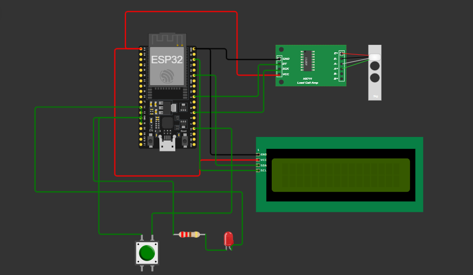

# Hardware Integration

The hardware integration of the **IoT Piano LED Visualizer System** involves the connection of several key components, including the **RGB LED strip (WS2812B)**, **push button sensors**, **LCD display**, and the **ESP32 microcontroller**. Below is a breakdown of how these components are connected and how they interact within the system.

## **Components Overview**:
- **RGB LED Strip (WS2812B)**: Provides visual feedback by lighting up according to the notes being played.
- **Push Button Sensors**: Detects key presses on the piano and sends data to the microcontroller.
- **LCD Display (16×2)**: Displays the current note being played and the mode (Tutorial or Play).
- **ESP32 Microcontroller**: Manages all components, processes inputs from the sensors, controls the LED strip, and communicates with the server via Wi-Fi.

## **Hardware Integration Diagram**

Include a **circuit diagram** showing the wiring connections between the components. Here’s a general outline of the connections:

| Component            | Pin on ESP32      | Pin on Component           |
| -------------------- | ----------------- | -------------------------- |
| LED Strip Data Pin    | GPIO 4            | DIN on WS2812B             |
| Push Button 1         | GPIO 12           | One leg of the push button  |
| Push Button 2         | GPIO 14           | One leg of the push button  |
| Push Button 3         | GPIO 27           | One leg of the push button  |
| Push Button (All)     | Ground            | Other leg of all buttons    |
| LCD SDA               | GPIO 21           | SDA on LCD                 |
| LCD SCL               | GPIO 22           | SCL on LCD                 |

The **RGB LED strip** connects to the ESP32 via a data pin, and the push buttons are wired to individual GPIO pins on the ESP32 to detect key presses.

#### **Working Flow**:
1. **Key Press Detection**: When a piano key is pressed (represented by push buttons), the corresponding signal is sent to the ESP32.
2. **LED Visualization**: The ESP32 controls the LED strip to light up specific LEDs in sync with the pressed key, providing real-time visual feedback.
3. **Display on LCD**: The ESP32 updates the LCD display with the current note being played.
4. **Play Mode Control**: The user can toggle between Tutorial Mode and Play Mode, and the ESP32 handles the visual and auditory feedback accordingly.
5. **Server Communication**: The ESP32 sends performance data, including the notes played and timing, to a backend server via Wi-Fi for tracking and analysis.

#### **Circuit Diagram Placeholder**:

#### **Power Supply**:
- The system can be powered using the ESP32's USB connection or an external power supply if greater mobility is required. Ensure the power supply provides sufficient current for the LED strip, as RGB LEDs can consume a significant amount of power when all LEDs are active.

---

This detailed breakdown highlights the essential connections and interactions between the components in the **IoT Piano LED Visualizer System**. The hardware integration ensures that the system operates seamlessly, providing real-time feedback and recording performance data for later review.