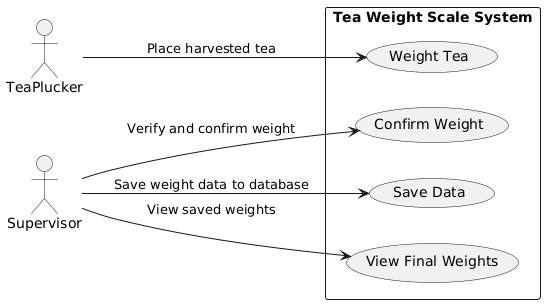
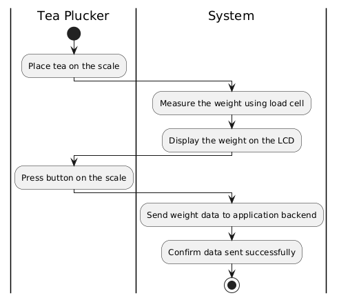
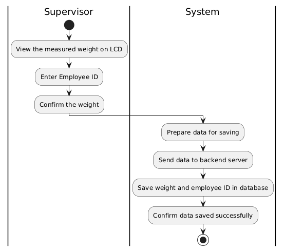
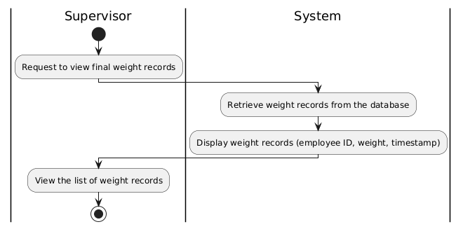

## Use Case Diagrams

The **Use Case Diagrams** illustrate how different actors (users) interact with the **IoT Piano LED Visualizer System**. The primary actors for this system are the **Learner** and **Administrator**. The use case diagram outlines the system's functionalities from the user's perspective.

#### **Primary Actors**:
1. **Learner**: A user who practices piano and uses the visual feedback system.
2. **Administrator**: A user responsible for managing songs, user performance data, and system maintenance.

---

### **Use Case Diagram 1: Learner and Administrator Interaction**

#### **Use Cases**:
1. **Select Song**:
   - **Actor**: Learner
   - **Description**: The learner selects a song from the list in the web interface to practice.

2. **Play Song**:
   - **Actor**: Learner
   - **Description**: The learner starts playing the song, and the LED strip visualizes the notes in real-time.

3. **Track Performance**:
   - **Actor**: Learner
   - **Description**: The learner's performance (score, mode, and timing) is tracked and stored in the system.

4. **View Performance Data**:
   - **Actor**: Learner
   - **Description**: The learner views their saved performance data, including scores and feedback, via the frontend.

5. **Manage Songs**:
   - **Actor**: Administrator
   - **Description**: The administrator uploads and manages the song data (notes, durations) for practice.

6. **Monitor System**:
   - **Actor**: Administrator
   - **Description**: The administrator ensures the system's performance, handling database updates and hardware status checks.

#### **Diagram Description**:
- **Select Song**: Learners choose a song to practice.
- **Play Song**: The system plays the selected song and provides visual feedback.
- **Track Performance**: Performance data is captured and stored.
- **Manage Songs**: Administrators upload new songs and manage the song list.

**Use Case Diagram Placeholder**: 

---

## Activity Diagrams

Activity diagrams visually represent the workflows and processes within the **IoT Piano LED Visualizer System**. These diagrams detail the interactions between actors (learners, administrators) and the system components, demonstrating how actions flow from one step to the next.

Below are the key activity diagrams relevant to the system:

---

### 1. **Playing a Song and Visualizing Notes Activity Diagram**

This diagram outlines the process in which the learner selects a song, the system plays the song, and the LEDs light up in sync with the notes being played.

#### **Steps**:
1. Learner selects a song from the list.
2. System loads the selected song's notes and durations.
3. System starts playing the song, sending signals to the LED strip to visualize the notes.
4. Learner plays along with the visual feedback provided by the LED strip.
5. System tracks performance and stores the score after the song ends.

**Diagram Representation**:
- **Start**: Learner selects a song.
- **System Activity**: Load and play the song.
- **User Activity**: Learner follows the notes using the LED strip.
- **System Activity**: Track performance and store data.
- **End**: System waits for the next song selection.

**Activity Diagram Placeholder**: 

---

### 2. **Confirming and Saving Performance Data Activity Diagram**

This diagram illustrates how the learner's performance data is confirmed and saved into the system after completing a song.

#### **Steps**:
1. Learner finishes playing the selected song.
2. System calculates the performance score based on the accuracy and timing of notes played.
3. System saves the performance data (song name, score, mode) into the database.
4. System notifies the learner that the data has been saved.

**Diagram Representation**:
- **Start**: Learner completes the song.
- **System Activity**: Calculate the score and timing.
- **System Activity**: Save the performance data in the database.
- **End**: Notify the learner that the data is saved.

**Activity Diagram Placeholder**: 

---

### 3. **Managing Songs Activity Diagram**

This diagram demonstrates how the administrator uploads and manages songs in the system for learners to practice.

#### **Steps**:
1. Administrator uploads new song data (song name, notes, durations) into the system.
2. System saves the song data into the database.
3. Administrator views or edits the existing songs as needed.
4. Learners can then select and practice these songs.

**Diagram Representation**:
- **Start**: Administrator uploads a new song.
- **System Activity**: Save song data in the database.
- **System Activity**: Display song in the available list for learners.
- **End**: Learners can access the new song.

**Activity Diagram Placeholder**: 

